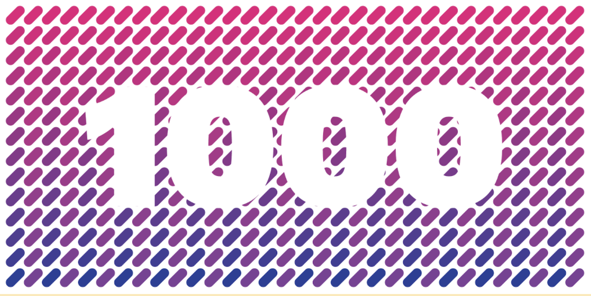

<h1>1KC: One Thousand Contributors Program</h1>
 

## What is the 1KC?

The Technical Education, Community, and Support (TCS) team(s) of the Web3 Foundation and Parity are 
launching an off-chain contributor program to support our community and contributors. We hope to start 
small with this program and learn as we go. Our intent is to be transparent as possible and even though
it will be centralized at first, overtime with feedback from our participants, we plan to decentralize
this project with hopes to move things on-chain as it makes sense. Think about the Polkadot launch,
it started as a Proof of Authority(PoA) network, and without any other functionality than ability to
create blocks with nodes controlled by the Web3 Foundation. Slowly we started releasing features that
allowed the network to be more decentralized, such as ability to become a validator, and then governance,
followed by balance transfers etc. With the same intentin in mind, we hope that you will be excited to help
us develop this program further!

For contributors, there are on-chain funding avenues through
[Treasury Proposals](https://wiki.polkadot.network/docs/learn-treasury#creating-a-treasury-proposal) 
proposals and [Tipping](https://wiki.polkadot.network/docs/learn-treasury#tipping).

The TCS team is offering another avenue to reward contributions that may encounter difficulties 
in existing funding methods, namely smaller contributions. In particular, the contributors program 
aims to capture contributions in the areas of **Technical Education**, **Community** and **Support**. 

It is our belief that this program will foster more engagement and contribution, while embarking 
on the WEB3 vision, we need all the help that we can get.
 
> The 1KC Program will help us build a stronger bond with our community and facilitate the creation 
> of quality content.

## How to Participate

You can signal your intent to participate by filling out this typeform we have created for you :)
https://form.typeform.com/to/I9vjnCcI

## Process

The first step is filling out the typeform, once we have your proposal we will:

1. Evaluate. Depending on which area you want to contribute your evaluators will be different.
2. Accept or deny. Once we review your proposal, we will get in touch with you about the status.
3. Define your delivery. All tasks will have different delivery requirements, we will clearly communicate
to you what your contribution will be required to fulfill.
4. Funding. Once the delivery of the task has been finalized, we will deposit your rewards to the account
that you shared with us.

## Team and Evaluators

Members of the Technical Education, Community and Support Teams at Web3 Foundation & Parity
Technologies will be the program curators and maintainers, in the form of **1KC Evaluators**

- Supervisor: Bill Laboon
- Technical Education: Radhakrishna Dasari, Emre Surmeli & Danny Salman
- Community: Elodie Dincuff & Urban Osvald
- Support: Michalis Fragkiadakis, Keegan Quigley & Anja Schuetz